# Campus Network Infrastructure & Security Architecture

> Enterprise-scale campus network architecture designed and implemented in Cisco Packet Tracer, featuring segmented departmental networks, centralized Layer 3 routing, dynamic route exchange, secure management, infrastructure services, and policy-driven traffic isolation.

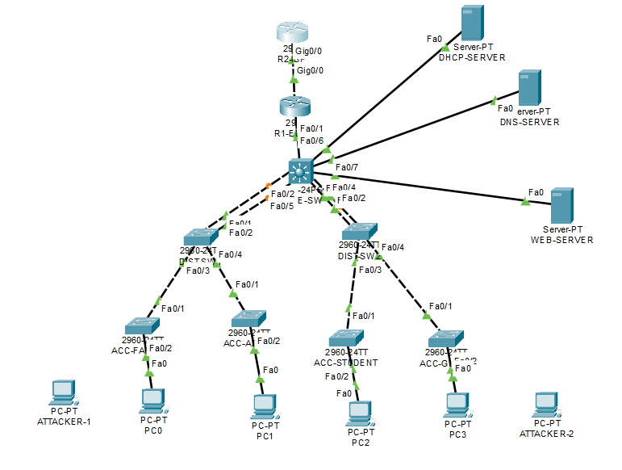

---

## Overview

This project simulates the deployment of a modern campus network supporting multiple organizational units while maintaining scalability, security, and operational simplicity.

The infrastructure is built around a Layer 3 core responsible for routing, service integration, policy enforcement, and route advertisement. Departmental access networks are isolated through VLAN segmentation, while centralized services provide addressing, name resolution, and application access across the campus environment.

The project demonstrates the implementation of enterprise networking concepts including Layer 2 switching, Layer 3 routing, dynamic routing protocols, centralized infrastructure services, and layered security controls.

---

## Architecture Overview

### Network Segments

| VLAN | Department | Subnet |
|--------|------------|---------|
| 10 | Administration | 10.0.10.0/24 |
| 20 | Faculty | 10.0.20.0/24 |
| 30 | Student | 10.0.30.0/24 |
| 40 | Server Infrastructure | 10.0.40.0/24 |
| 50 | Guest Network | 10.0.50.0/24 |
| 99 | Management | 10.0.99.0/24 |

### Core Components

- Layer 3 Core Switch
- Access Layer Switches
- Edge Router
- Upstream Router
- DHCP Server
- DNS Server
- Internal Web Server

---

## Design Objectives

The network was designed to satisfy the following operational requirements:

- Department-level traffic isolation
- Centralized routing and policy enforcement
- Dynamic host provisioning
- Internal service discovery
- Secure infrastructure management
- Controlled inter-department communication
- Dynamic route propagation
- Layer 2 loop prevention
- Scalable and maintainable architecture

---

## Technical Implementation

### Layer 2 Infrastructure

#### VLAN Segmentation

Departmental traffic is logically separated using VLANs to reduce broadcast domains, improve security, and simplify administration.

#### 802.1Q Trunking

Trunk links were configured between switching devices to transport multiple VLANs across the campus backbone while preserving VLAN boundaries.

#### Spanning Tree Protocol (STP)

Per-VLAN Spanning Tree was deployed to eliminate Layer 2 loops and maintain a stable switching topology.

The Layer 3 Core Switch was configured as the root bridge to provide deterministic path selection throughout the network.

---

### Layer 3 Infrastructure

#### Inter-VLAN Routing

Switch Virtual Interfaces (SVIs) were configured on the Layer 3 Core Switch to provide centralized routing between VLANs.

#### OSPF Dynamic Routing

Open Shortest Path First (OSPF) was implemented between Layer 3 devices to dynamically exchange routing information.

Key benefits:

- Automated route learning
- Simplified network expansion
- Reduced static route dependency
- Faster route convergence

---

### Infrastructure Services

#### DHCP

Centralized DHCP services provide dynamic IP address allocation across multiple VLANs.

#### DHCP Relay

The Layer 3 Core Switch forwards DHCP requests across routed boundaries using helper-address functionality, enabling centralized address management.

#### DNS

An internal DNS server provides hostname resolution for campus resources.

Example:

```text
www.campus.local
```

#### Web Services

An internal web server hosts campus resources and demonstrates application accessibility across segmented network environments.

---

## Security Architecture

Security controls were implemented using a layered approach to protect network infrastructure and enforce communication policies.

### Access Control Lists (ACLs)

Extended ACLs were deployed to enforce inter-department traffic restrictions.

Examples include:

- Restricting Guest VLAN access to internal departments
- Restricting Student VLAN access to administrative resources
- Preserving controlled access to shared services

### Secure Device Management

Management access was secured using:

- SSH Version 2
- RSA Key Infrastructure
- Local User Authentication

### Port Security

Access-layer interfaces implement Port Security controls to prevent unauthorized endpoint connectivity.

Implemented controls include:

- Sticky MAC Learning
- MAC Address Limitation
- Violation Detection
- Unauthorized Device Prevention

---

## Validation & Testing

The network was extensively tested to validate functionality, security, and service availability.

### Connectivity Validation

- Intra-VLAN communication
- Inter-VLAN communication
- Gateway reachability
- End-to-end path verification

### Service Validation

- DHCP lease allocation
- DNS name resolution
- Internal web service accessibility

### Security Validation

- ACL policy enforcement
- Port Security violation testing
- SSH authentication verification

### Routing Validation

- OSPF neighbor establishment
- Dynamic route propagation
- Routing table verification

---

## Implementation Evidence

### Network Topology


### VLAN Configuration

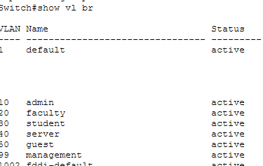

### Inter-VLAN Routing

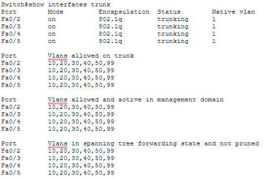

### Spanning Tree Protocol

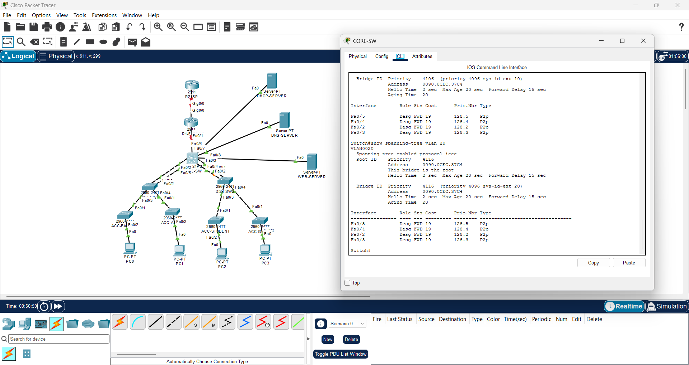

### DHCP Services

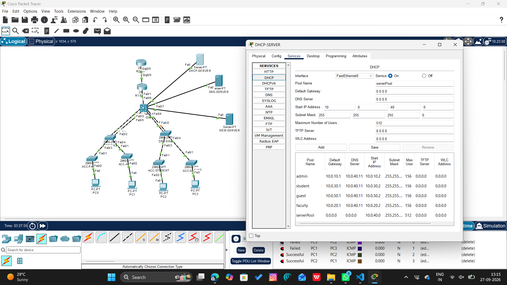

### DNS Resolution

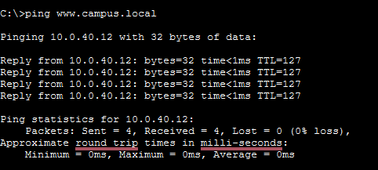

### Access Control Lists

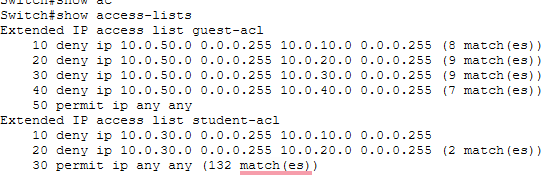

### SSH Management

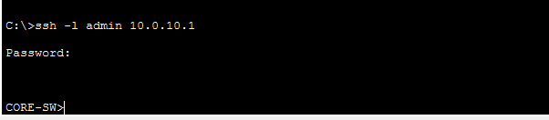
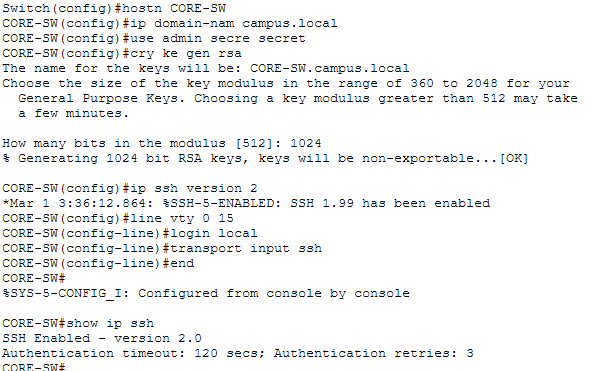

### Port Security

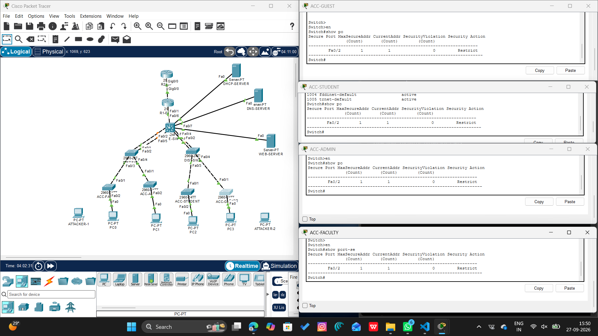

### OSPF Dynamic Routing

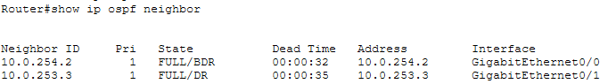

---

## Technologies Used

| Domain | Technologies |
|----------|-------------|
| Switching | VLANs, 802.1Q Trunking, STP |
| Routing | Inter-VLAN Routing, OSPF |
| Services | DHCP, DHCP Relay, DNS, HTTP |
| Security | ACLs, SSH, Port Security |
| Platform | Cisco Packet Tracer |

---

## Key Verification Commands

```bash
show vlan brief
show interfaces trunk
show spanning-tree
show ip route
show ip ospf neighbor
show ip protocols
show access-lists
show port-security
show ip ssh
```

---

## Repository Structure

```text
campus-network-infrastructure-security
│
├── Campus_Network_Project.pkt
├── README.md
│
├── topology/
│   └── campus_topology.png
│
├── screenshots/
│   ├── vlan_configuration.png
│   ├── inter_vlan_routing.png
│   ├── stp.png
│   ├── dhcp.png
│   ├── dns.png
│   ├── acls.png
│   ├── ssh.png
│   ├── port_security.png
│   └── ospf.png
│
└── configs/
    ├── core-switch.txt
    ├── router-r1.txt
    └── router-r2.txt
```

---

## Future Enhancements

Planned enhancements include:

- NAT/PAT Integration
- EtherChannel Deployment
- HSRP Gateway Redundancy
- Syslog Infrastructure
- NTP Synchronization
- Centralized Network Monitoring
- Wireless Network Expansion

---

## Skills Demonstrated

- Enterprise Network Design
- Layer 2 & Layer 3 Switching
- Dynamic Routing
- Network Security
- Infrastructure Services
- Access Control Implementation
- Network Troubleshooting
- Service Validation
- Cisco CLI Configuration

---

## Outcome

Successfully designed, deployed, secured, and validated a multi-segment campus network architecture implementing enterprise networking concepts including VLAN segmentation, inter-VLAN routing, dynamic routing, centralized infrastructure services, secure device management, policy-based traffic control, and layered security mechanisms.

The project demonstrates practical experience with network design, deployment, security hardening, service integration, routing protocols, and operational troubleshooting within a simulated enterprise environment.
